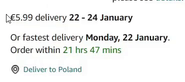
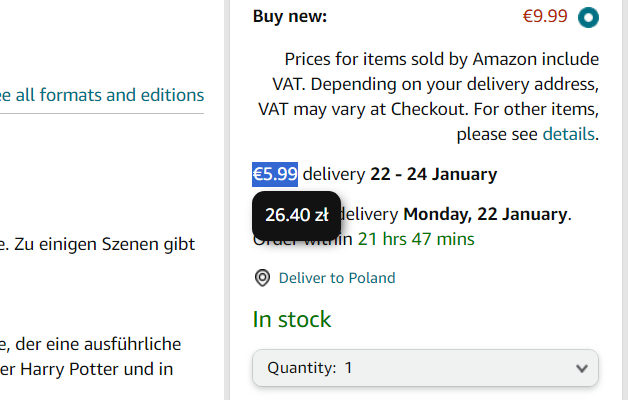
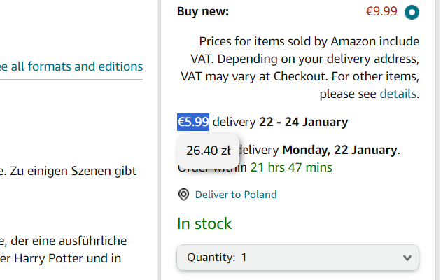
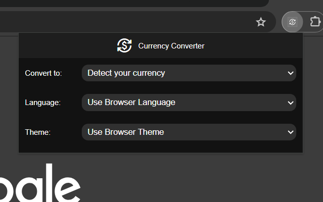
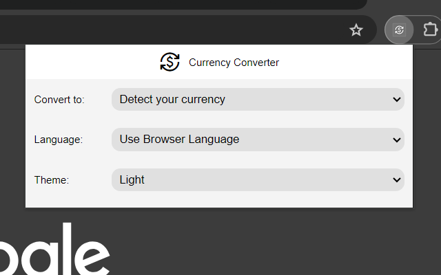

# Currency Converter Chrome Extension

## Overview

Welcome to the Currency Converter Chrome Extension! This extension simplifies currency conversion by automatically detecting the user's currency and providing support for 148 currencies. Enjoy a multilingual experience with language options in English, Polish, and German. The extension also features a light and dark theme for a personalized touch.

## Features

- **Text Selection Conversion:** Convert currencies by selecting text with currency values on any webpage.
- **Automatic User Currency Detection:** Detect the user's currency based on their location.
- **Real-time Exchange Rates:** Get up-to-date exchange rates for accurate conversions.
- **Multilingual Support:** Choose from English, Polish, and German languages for a customized experience.
- **Light and Dark Theme:** Toggle between light and dark themes to suit your preferences.
- **User-friendly Interface:** Intuitive and simple design for a seamless user experience.

## Installation

Follow these steps to install the extension:

1. Download the extension files.
2. Open Google Chrome.
3. Go to `chrome://extensions/`.
4. Enable "Developer mode" in the top right corner.
5. Click on "Load unpacked" and select the folder where you downloaded the extension files.

Alternatively, you can install the extension directly from the [Chrome Web Store](https://chromewebstore.google.com/detail/currency-converter/alhjppeeeklkfjecgipijppbgnmgipnh?hl=en-US&utm_source=ext_sidebar).

## Usage

1. Browse any webpage containing currency values.
2. Select the text with the currency value you want to convert.
3. The converted amount will be displayed in a popup.

## Demo

*Visual representation of the extension in action.*

## Screenshots

*Popup with converted amount in dark theme.*

*Popup with converted amount in light theme.*

*Extension page in dark theme.*

*Extension page in light theme.*

## Settings

- **Convert to:** Set your desired target currency. Alternatively, choose 'Detect your currency' to automatically identify your currency based on your current location.
- **Theme:** Select between light and dark themes. Alternatively, opt for 'Use Browser Theme' to synchronize with your browser's theme settings.

## Language

- **Select Language:** Select your preferred language from English, Polish, or German. Alternatively, choose 'Use Browser Language' if your browser language is set to one of these three options

## Support

If you encounter any issues or have suggestions, please [open an issue](https://github.com/adampawelczyk/Currency-Converter/issues).

## Contributing

Contributions are welcome! Fork the repository and submit a pull request.

## License

This project is licensed under the [MIT License](https://github.com/adampawelczyk/Currency-Converter/blob/master/LICENSE).

## External APIs

### Currency API
- **Provider:** Fawaz Ahmed
- **API Documentation:** [Currency API Documentation](https://github.com/fawazahmed0/exchange-api)

